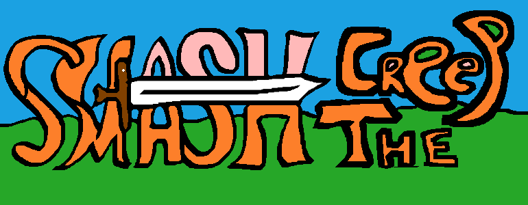
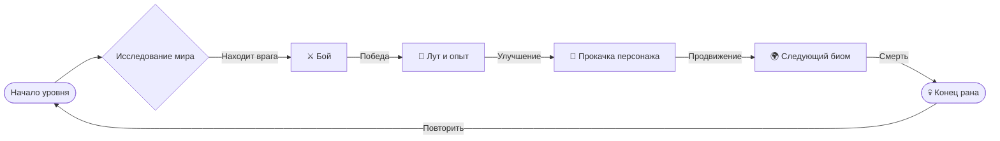
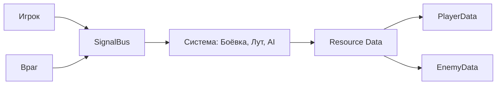
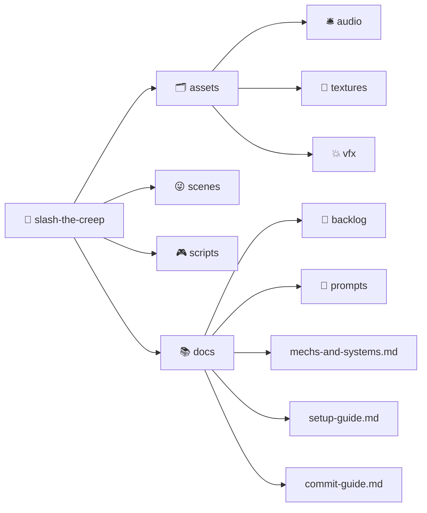

  
  <h1>🗡️ Smash the Creep</h1>
  <h3><i>3D Action Roguelike на Godot 4.5</i></h3>
  <q><i>В мире, где слизь не прощает ошибок, герой рождается с мечом - и каплей надежды.</i></q>
   
   

     

---

## 🎮 Описание

**Smash the Creep** - это атмосферный 3D-экшен с элементами **RPG** и **рогалика**, созданный на **Godot 4.5**.  

Игроку предстоит:

- Исследовать процедурно сгенерированные уровни
- Сражаться с волнами существ и мини-боссами
- Собирать лут, артефакты и выстраивать билд
- Прокачивать способности через перки и экипировку

---

## ⚙️ Ключевые особенности

| Система             | Описание                                          |
| ------------------- | ------------------------------------------------- |
| 🗡️ **Боевая**       | Комбо-атаки, урон по зонам, взаимодействие стихий |
| 🧠 **ИИ врагов**    | State Machine, паттерны поведения, фазы боссов    |
| 💎 **Лут и перки**  | Механика сборок, сетовые бонусы, прокачка         |
| 🌍 **Мир**          | Процедурная генерация, биомы, ловушки             |
| 💰 **Экономика**    | Сундуки, торговцы, валюта                         |
| 🔔 **События**      | Случайные и глобальные ивенты                     |
| 📜 **Документация** | Подробное описание в `docs/`                      |

---

## 🔁 Геймплейный цикл

---

## 🧩 Архитектура проекта

---

## 🏗️ Структура проекта

---

## 🚀 Начало работы

Для инструкции по установке и первому запуску: [docs/setup-guide.md](./docs/setup-guide.md)

---

## 📅 Бэклог и планирование

Текущая неделя:
**MVP: базовое взаимодействие Игрока и Врага**: [docs/backlog/01-backlog.md](./docs/backlog/01-backlog.md)

Планирование ведётся по методике **MoSCoW** (Must / Should / Could / Won’t Have).

---

## 👥 Авторы проекта

| Участник     | Роль                                                                                     | Ссылка                                                |
| ------------ | ---------------------------------------------------------------------------------------- | ----------------------------------------------------- |
| 🧀 Влад      | Руководитель проекта, Разработка, Аналитика, Документация, Саунд-дизайн, "Сырная власть" | [MindlessMuse666](https://github.com/MindlessMuse666) |
| 🔪 Егор      | Разработка, Креатив, «Ответственный за чёлку»                                            | [nineteentearz](https://github.com/nineteentearz)     |
| 😜 Каракалбе | Разработка, Креатив, «Ответственный за Слаймов»                                          | [bukabtw](https://github.com/bukabtw)                 |
| 🐢 Саша      | Разработка, «Администрация баз данных»                                                   | [FrierenWay](https://github.com/FrierenWay)           |
| 🎨 Дженна    | Художник, Дизайн, 3D-моделирование, «Карточная мафия»                                    | [Jenko-zhulenko](https://github.com/Jenko-zhulenko)   |
| 🌸 Аня       | Дизайн, 3D-дизайн, «Аня»                                                                 | Анонимно, администрации печенья                       |

> Отдельное спасибо **Бастрыкину** за знания, мотивацию и вайб - [ks54.ru](https://www.ks54.ru/)

---

## 📄 Лицензия

Проект распространяется под лицензией **MIT**.
См. [LICENSE](./LICENSE)

---

  © 2025 <a href="https://github.com/KontsertKishlaka" target="_blank" >KontsertKishlaka</a> - Smash the Creep
   
  <i>“Made with Love and Godotshina 4.5”</i>

