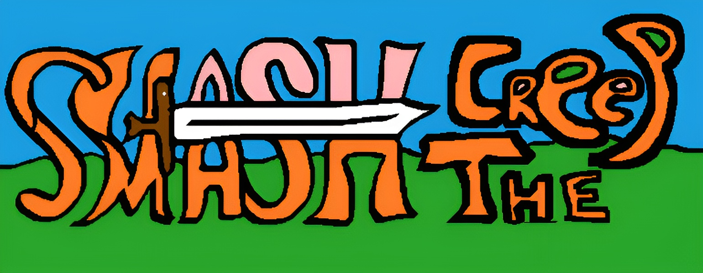

<div align="center">
  
  <h1>👾 Стиль коммитов</h1>
  <h3><i>Smash the Creep</i></h3>
  <q><i>В мире, где слизь не прощает ошибок, герой рождается с мечом - и каплей надежды.</i></q>
  <br>
  <br>

 
</div>

---

## Формат коммитов

```bash
<тип>(<область>): <краткое описание>
```

### Типы

- `feat` - Новая функциональность
- `fix` - Исправление ошибки
- `docs` - Изменения в документации
- `refactor` - Изменения кода без исправления ошибок/добавления фич
- `chore` - Изменение структуры проекта, обновление зависимостей/сборки, добавление плагина и т.д.
- `asset` - Добавление/обновление ассетов (для дизайнеров)
- `audio` - Добавление/обновление аудио (для саунд-дизайнеров)

### Области

**Разработка:**

- `player` - Системы игрока
- `enemy` - Системы врагов
- `env` - Системы окружения (объекты, свет)
- `combat` - Боевая система
- `ui` - Пользовательский интерфейс
- `lvl` - Генерация уровней, окружение
- `invent` - Инвентарь, экипировка
- `anim` - Анимации
- `proj` - Структура проекта, папки, файлы
- `audio` - Звуки, музыка
- `deps` - Зависимости, плагины

**Дизайн/Саунд-дизайн:**

- `imp` - Импорт ассетов
- `model` - 3D модели
- `texture` - Текстуры
- `vfx` - Визуальные эффекты, частицы
- `sfx` - Звуковые эффекты
- `music` - Музыка
- `rig` - Риггинг, скелеты

## Примеры хороших коммитов

**Разработка:**

- `feat(player): add basic move; update jumping | chore(proj): реорганизация папок ассетов по типам`
- `fix(enemy): remove player tracking through walls | feat(inventory): optimize item sorting`
- `fix(enemy): remove slime corners stucking`
- `refactor(inventory): optimize scripts`
- `chore(proj): restruct assets dirs`
- `chore(deps): add markdown supporting plugin`

**Дизайн/Саунд-дизайн:**

- `asset(imp): env props`
- `asset(vfx): base attack particles`
- `fix(audio): normalize footstep volume`
- `asset(anim): basic player idle/run anims`
- `asset(texture): update player model albedo map`
- `asset(rig): add player rig`
- `fix(model): the barrel model UV-map`
- `asset(model): add basic player model`

> 💬 Железное правило: "Чем кратче - тем лучше" \:)
> А описание (body) коммита пишется ТОЛЬКО при необходимости/при желании

---

<div align="center">
  <sub>© 2025 <a href="https://github.com/KontsertKishlaka" target="_blank">KontsertKishlaka</a> - Smash the Creep</sub>
  <br>
  <sup><i>“Единый стиль коммитов”</i></sup>
</div>
