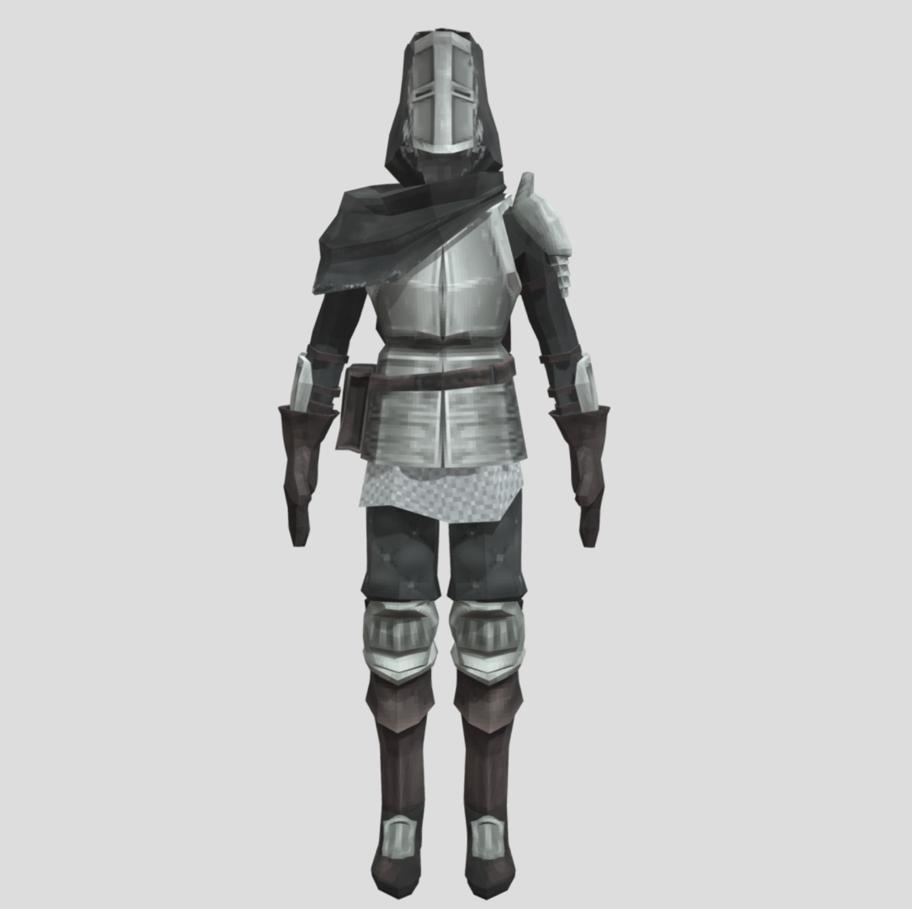
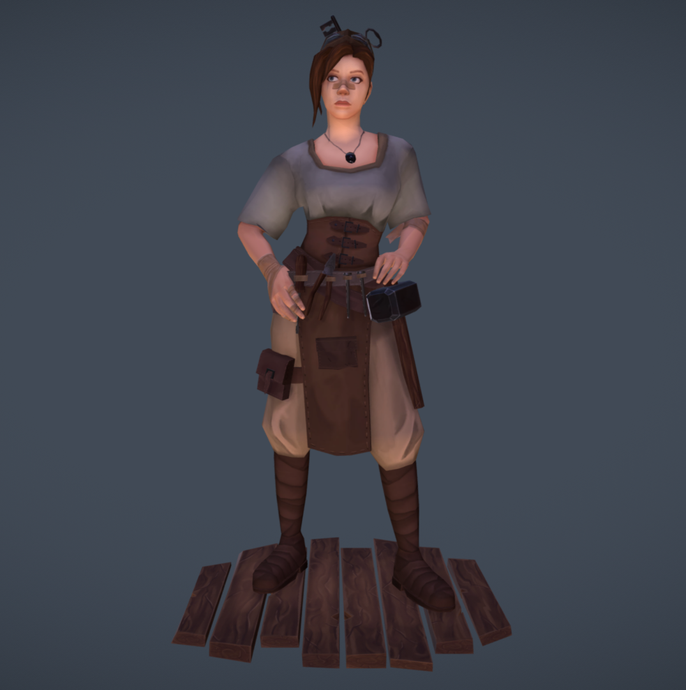
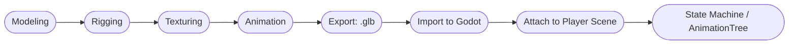

  
  <h1>🎨 Игрок: 3D Модель и Анимации</h1>
  <h3><i>Smash the Creep</i></h3>
  <q><i>Когда меч становится продолжением воли, даже слайм дрожит от красоты и гнева.</i></q>
   
   

    

---

## 🧍 Общая концепция

Игрок - **основной управляемый 3D персонаж**, через которого взаимодействуют все ключевые системами проекта.
В текущем этапе разработки цель - создать **универсальную low-poly модель девушки** (без брони), подходящую для ближнего боя с мечом и дальнейшего расширения (броня, классовые вариации, эмоции и т.п.).

> ⚔️ **Ключевая цель этапа:** подготовить визуально привлекательную, оптимизированную и гибко риггованную модель игрока для реализации core-геймплея от первого лица.

---

## ✨ Визуальный стиль

| Параметр                | Описание                                                                                                                                               |
| ----------------------- | ------------------------------------------------------------------------------------------------------------------------------------------------------ |
| **Сеттинг**             | Европейское средневековье с лёгким фэнтезийным акцентом                                                                                                |
| **Пол**                 | Женский                                                                                                                                                |
| **Возрастной диапазон** | Молодая взрослая (18–25 лет)                                                                                                                           |
| **Стилистика**          | Low-poly (500–2000 трисов)                                                                                                                             |
| **Лицо и эмоции**       | Мягкие черты лица, допускаются необычные детали (фиолетовые глаза, веснушки, цветные волосы)                                                           |
| **Одежда**              | Простая деревенская/путешественническая, без тяжёлой брони                                                                                             |
| **Оружие (основа)**     | Сама модель безоружна, но предполагается, что Игрок в будущем сможет держать в руках разные типы оружия (меч, лук, магия) в виде **отдельных** моделек |

---

## 📸 Референсы

  <table>
    <tr>
      <td align="center">
        <b>Low-Poly Knight (пример low-poly тела, но без шлема 😜)</b> 
        <a href="https://sketchfab.com/3d-models/the-traveller-low-poly-knight-character-0c228b9534d9453a92b842878f8ceb3b" target="_blank">[Sketchfab: The Traveller - Low Poly Knight]</a> 
        
      </td>
      <td align="center">
        <b>Blacksmith's Apprentice (пример лица и одежды)</b> 
        <a href="https://sketchfab.com/3d-models/the-blacksmiths-apprentice-a09484034ceb477cbf33cb54a1cf9bf4" target="_blank">[Sketchfab: The Blacksmith’s Apprentice]</a> 
        
      </td>
    </tr>
  </table>

> 💡 Эти модели используются **только как стилистические ориентиры**. Финальная модель игрока должна быть уникальной и узнаваемой. Любой креатив - приветствуется (например, веснушки, необычная прическая и её цвет, фиолетовые глаза и прочее).

---

## ⚙️ Техническая спецификация

| Категория         | Требования                                                                         |
| ----------------- | ---------------------------------------------------------------------------------- |
| **Полигоны**      | 500–2000 трисов (основной LOD), при желании можно добавить LOD0/LOD1               |
| **Текстуры**      | 1024×1024 (Base Color, Normal, Roughness - объединяются в atlas при необходимости) |
| **Материалы**     | Один общий материал/atlas для тела и одежды                                        |
| **Скелет**        | Humanoid rig, 20–30 костей (IK для рук/ног, weapon bone)                           |
| **Риггинг**       | Поддержка стандартных анимаций Godot Humanoid                                      |
| **Экспорт**       | Формат `.glb`, ориентация Y-up, масштаб 1:1                                        |
| **Совместимость** | Импорт в `Player (CharacterBody3D)` → узел `Model`                                 |

---

## 🩰 Анимации

### 🎬 MUST HAVE

| Название | Назначение       | Цель                                |
| -------- | ---------------- | ----------------------------------- |
| `idle`   | Ожидание/стояние | Базовое состояние бездействия       |
| `jump`   | Прыжок           | Универсальная вертикальная анимация |

### 🎯 SHOULD HAVE

| Название       | Назначение             | Цель                           |
| -------------- | ---------------------- | ------------------------------ |
| `attack_melee` | Атака одноручным мечом | Основная анимация ближнего боя |

### 💭 COULD HAVE

| Название      | Назначение       | Применение                                          |
| ------------- | ---------------- | --------------------------------------------------- |
| `run`         | Бег с мечом      | Используется в боевом и исследовательском состоянии |
| `take_damage` | Получение урона  | Состояние реакции на попадание                      |
| `death`       | Смерть персонажа | Завершение рана                                     |

### 😨 WON'T HAVE

| Название      | Назначение      | Применение               |
| ------------- | --------------- | ------------------------ |
| `item_pickup` | Подбор предмета | Сценарное взаимодействие |
| `look_around` | Осмотр          | Для добавления живости   |

---

## 🧠 Пайплайн: Blender → Godot

> 🎨 Все анимации должны быть протестированы в Godot через `AnimationTree` и привязаны к состояниям игрока (`idle`, `run`, `attack`, `take_damage`, `death`).

---

## 📋 MoSCoW-задачи для 3D-дизайнера

| Приоритет                     | Задача                                                         | Комментарий                              |
| ----------------------------- | -------------------------------------------------------------- | ---------------------------------------- |
| **MUST**                      | Создать базовую low-poly модель девушки (humanoid)             | Без брони, оптимизированная для анимации |
| **MUST**                      | Риггинг по humanoid-схеме + weapon socket                      | Для интеграции в Godot                   |
| **MUST**                      | Добавить базовые анимации: `idle`, `jump`                      | Используются в MVP                       |
| **SHOULD**                    | Разработать текстуры и материалы в стиле low-fantasy           | Без лишних бликов, приятная палитра      |
| **SHOULD**                    | Создать дополнительные анимации: `attack_melee`                | Для расширения геймплея                  |
| **COULD**                     | Подготовить LOD-варианты модели                                | Для оптимизации                          |
| **COULD**                     | Подготовить LOD-варианты модели                                | Для оптимизации                          |
| **COULD**                     | Создать дополнительные анимации: `run`, `take_damage`, `death` | Сценические возможности                  |
| **WON’T (на текущий спринт)** | Полная кастомизация одежды и брони                             | Перенесено на фазу 2                     |

---

## 😜 [Игрок](../../../scripts/player/player.gd "Player: main script") в Godot

Подробнее о реализации Игрока в Godot: [Базовый Игрок](./design/player/player-design.md "Игрок: Базовое представление")

---

  © 2025 <a href="https://github.com/KontsertKishlaka" target="_blank">KontsertKishlaka</a> - Smash the Creep
   
  <i>“Спецификация Дизайна Игрока”</i>

